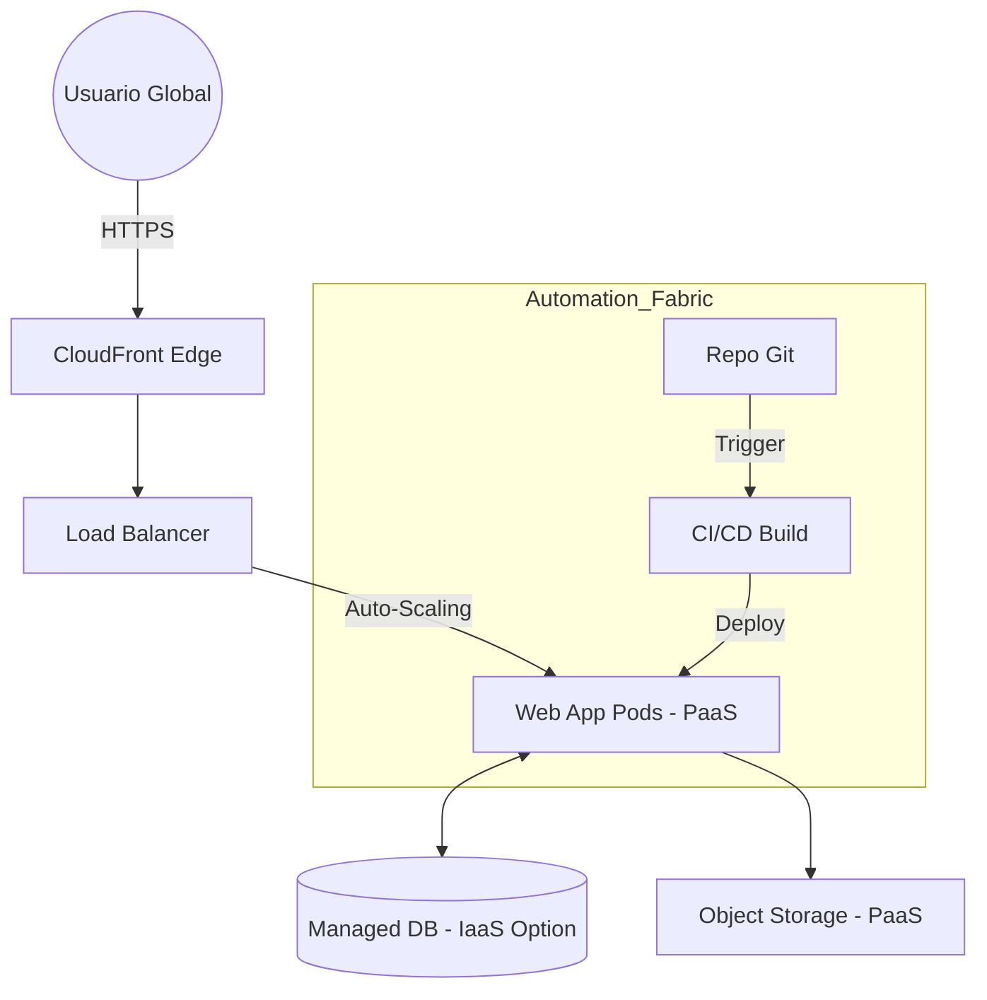

# Plan Estratégico de Transformación Digital: "The Agile Awakening"
**Cliente:** The Legacy Dev House  
**Consultoría:** Team 0x01 (Senior Lead Digital Architects)  
**Fecha:** 18 de Marzo de 2026  
**Clasificación:** Confidencial / Consultoría Big Four

---

## 1. Introducción y Contexto Operativo
The Legacy Dev House se encuentra en una encrucijada crítica. Actualmente, su modelo operativo basado en servidores físicos locales, ausencia de control de versiones y metodologías en cascada (*Waterfall*) representa un riesgo existencial en un mercado marcado por la inmediatez y el modelo *SaaS*. Este plan detalla la hoja de ruta integral para transformar esta estructura analógica en una **Cloud-Native Agile Powerhouse**.

---

## Bloque I: Auditoría y Estrategia (RA6: a, b, c, d, e)

### 1.1 Metas Estratégicas y Visión de Negocio
Nuestra estrategia no es solo tecnológica, es una recalibración del valor de negocio. Hemos definido tres pilares de éxito para los próximos 3 años:
1.  **Métrica de Velocidad (Time-to-Market):** Reducción neta del 45% en los ciclos de entrega. La implementación de **GitOps** permitirá pasar de despliegues trimestrales manuales a despliegues diarios automatizados.
2.  **Métrica de Disponibilidad (Uptime):** Alcanzar el **99.99%** de disponibilidad eliminando el hardware físico "Single Point of Failure" (SPOF) y migrando a infraestructuras Cloud Multi-AZ.
3.  **Eficiencia Cognitiva:** Aumento del 30% en la capacidad de producción mediante la integración de herramientas de IA generativa en el ciclo de vida del desarrollo.

### 1.2 Auditoría de Inventario Digital (As-Is vs To-Be)

| Dimensión Técnica | Estado Actual (As-Is) | Estado Objetivo (To-Be) | Argumentación Estratégica |
| :--- | :--- | :--- | :--- |
| **Control de Código** | Carpetas locales / ZIPs | **GitHub Enterprise** | Evitar silos de conocimiento y colisiones de código; habilitar el trabajo asíncrono. |
| **Infraestructura** | Servidores Físicos locales | **Kubernetes (EKS/AKS)** | Eliminar costes de mantenimiento físico y riesgos de siniestro local. |
| **Despliegue** | Copiado manual de archivos | **CI/CD Pipelines (GitHub Actions)** | Garantizar que cada entrega pase por pruebas automatizadas de seguridad y calidad. |
| **Gestión de Datos** | Servidor Único sin réplica | **Managed RDS Multi-AZ** | Asegurar la integridad y resiliencia del activo más valioso de la empresa. |

### 1.3 Análisis de Brecha (Gap Analysis) y Escalabilidad a 5 Años
El salto de analógico a nube se realizará mediante una estrategia de **Migración en Caliente**. Utilizaremos VPNs cifradas para mantener la comunicación entre los sistemas antiguos y los nuevos durante la fase de transición. A **5 años**, el plan prevé la migración hacia arquitecturas **Serverless Event-Driven**, donde el coste total de propiedad (TCO) se reducirá drásticamente al pagar solo por el tiempo de computación real, permitiendo una expansión global sin barreras geográficas.

---

## Bloque II: Infraestructura, Datos e Integración (RA5: b, f, g | RA6: f, h, i)

### 2.1 Diseño de Arquitectura Cloud-Native (System Architecture)

### 2.2 Ciclo de Vida del Dato (Data Life Cycle)
Gestionaremos el dato con un enfoque de **Soberanía y Seguridad (RA6: h)**:
1.  **Ingesta (Creation):** Los datos se capturan mediante APIs validadas en el Gateway. No se permite la entrada de datos no estructurados para evitar la "deuda de datos".
2.  **Procesamiento (Storage/Usage):** Uso de funciones serverless para transformar y cifrar los datos antes de su almacenamiento persistente en la nube.
3.  **Archivado (Archiving):** Tras 12 meses de inactividad, los datos pasan a sistemas de coste ultra-bajo (Cold Storage) indexados para cumplimiento legal.
4.  **Purga (Deletion/Purge):** Implementación de una política de **Purga Automatizada** que elimina registros permanentemente tras el periodo legal (GDPR), garantizando el cumplimiento normativo sin intervención humana.

### 2.3 Estrategia Cloud: PaaS vs IaaS
Adoptaremos un enfoque **Híbrido de Servicios**. 
- **PaaS (Platform as a Service)** se utilizará para el 90% de las aplicaciones web y almacenamiento, permitiendo una agilidad operativa superior.
- **IaaS (Infrastructure as a Service)** se reservará para motores de bases de datos antiguos que requieren configuraciones de sistema operativo específicas que aún no son soportadas plenamente en modelos administrados, garantizando la compatibilidad durante la migración.

---

## Bloque III: IA y Ciberseguridad (RA4 | RA5: i | RA6: g)

### 3.1 Caso de Uso IA: Predicción de Defectos en Tiempo Real
Implementaremos un modelo de **Machine Learning en Python** integrado en el pipeline de desarrollo. Este modelo analizará la complejidad de cada cambio en el código y predecirá la probabilidad de que introduzca un error crítico antes de que llegue a producción.

**Efecto:** Reducción del 35% en los costes de mantenimiento post-entrega y liberación de recursos de QA manual.

### 3.2 Auditoría de Seguridad y Cumplimiento Legal
Nuestra auditoría ha revelado brechas críticas que solventaremos siguiendo los marcos **NIST** e **ISO 27001**:

1.  **Acceso Perimetral:** Implementación de **SSO (Single Sign-On) y MFA** para todo el personal. (Mitigación de robo de credenciales).
2.  **Cifrado de Datos:** Uso de estándares **AES-256** para datos en reposo y **TLS 1.3** en tránsito. (Cumplimiento RGPD).
3.  **Defensa de Capa 7:** Despliegue de un **WAF (Web Application Firewall)** para bloquear ataques de inyección y DDoS antes de que toquen la infraestructura lógica.

---

## Bloque IV: RRHH y Gestión del Cambio (RA6: j, k)

### 4.1 Plan de Recualificación (Upskilling Journey)
No reemplazamos a las personas; las evolucionamos. El plan consta de 3 fases de 4 semanas cada una:
- **Fase I: Fundamentos Modernos.** Uso de Git, flujos de colaboración y terminal de comandos.
- **Fase II: El Ecosistema Cloud.** Dockerización de aplicaciones y despliegue en entornos de staging.
- **Fase III: Desarrollo Aumentado por IA.** Uso ético y productivo de Co-Pilots para optimización de código.

### 4.2 Liderazgo del Cambio (Modelo ADKAR)
Utilizaremos el modelo **ADKAR** para gestionar la transición psicológica:
-   **Conciencia y Deseo:** Demostraremos cómo las nuevas herramientas eliminan las tareas más tediosas (como los despliegues nocturnos manuales).
-   **Entorno Seguro:** Instalaremos entornos "Sandbox" (espacios de prueba) donde los empleados puedan aprender fallando sin riesgo para el negocio actual, reduciendo la ansiedad frente a lo desconocido.

---
**Firmado:**  
*Lead Digital Architect*  
"Hacia una empresa resiliente, escalable y soberana"
