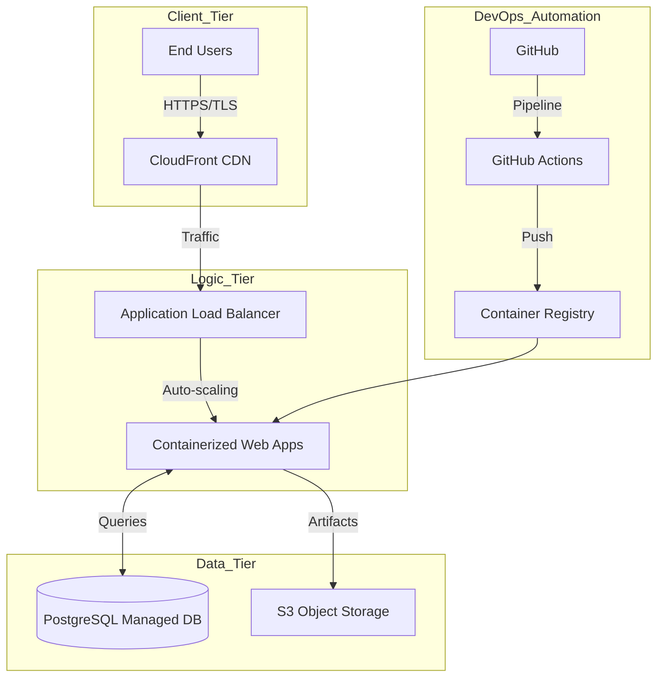

# Digital Transformation Plan: The Legacy Dev House
**Consultoría de Transformación Digital | Equipo Senior**

---

## Bloque I: Auditoría y Estrategia (RA6: a, b, c, d, e)

### 1.1 Strategic Goals (3 Años)
- **Operatividad Agile**: Transition 100% of projects to Git-based workflows and CI/CD pipelines to achieve a 45% reduction in time-to-market.
- **Resiliencia Cloud**: Eradicate physical server dependency, migrating to a Tier-4 High-Availability Cloud Infrastructure with 99.99% uptime.
- **Cognitive Development**: Integrate AI-assisted coding and testing to increase overall developer productivity by 30% by the end of Year 3.

### 1.2 Digital Inventory: As-Is vs. To-Be
| Área de Negocio | Estado Actual (As-Is) | Propuesta Digital (To-Be) | Encaje Estratégico |
| :--- | :--- | :--- | :--- |
| **Gestión de Código** | Carpetas locales / ZIPs | **GitOps (GitHub Enterprise)** | Control de versiones y auditoría total. |
| **Infraestructura** | Servidores físicos On-Premise | **Hybrid Cloud (Azure/AWS)** | Escalabilidad infinita y ahorro OpEx. |
| **Calidad (QA)** | Manual Testing sobre producción | **Automated CI/CD Testing** | Estabilidad y despliegues sin errores. |
| **Colaboración** | Archivos compartidos / Silos | **Agile Ecosystem (Jira/Slack)** | Transparencia y flujos horizontales. |

### 1.3 Gap Analysis: Estrategia de Transición
Para garantizar la convivencia de sistemas legados y modernos:
- **Phase 1: Hybrid Core**: Implementación de conexiones VPN S2S entre los servidores físicos actuales y la nueva VPC en la nube.
- **Phase 2: Data Replication**: Uso de herramientas de sincronización (AWS DMS) para mantener bases de datos espejadas durante la transición.
- **Phase 3: Traffic Shadowing**: Ejecución de nuevas versiones de software en paralelo para validar resultados sin afectar al flujo real.

### 1.4 Future Needs: Escalabilidad (5 Años)
A 5 años, la empresa requerirá:
- **Serverless Evolution**: Transición completa de instancias IaaS a modelos orientados a eventos (Lambda/Fargate) para optimizar costes.
- **Edge Computing**: Despliegue de nodos cercanos al cliente para aplicaciones de baja latencia.
- **AI Agent Orchestration**: Integración de agentes autónomos para la auto-reparación (Self-healing) de la infraestructura.

---

## Bloque II: Infraestructura, Datos e Integración (RA5, RA6)

### 2.1 System Architecture Diagram (English Terminology)

### 2.2 Data Life Cycle (RA6: h)
1.  **Ingestion**: Recepción de datos vía API Gateways con validación de esquema en tiempo real.
2.  **Processing**: Transformación de datos mediante procesos Batch (Spark) o Streaming (Kafka) para analítica.
3.  **Storage**: Almacenamiento persistente en bases de datos relacionales y NoSQL según el caso de uso.
4.  **Archiving**: Migración automática de datos inactivos a almacenamiento de bajo coste (Glacier) tras 12 meses.
5.  **Deletion (Purge)**: Eliminación definitiva de datos sensibles tras el periodo legal (GDPR/RGPD) o por solicitud del usuario mediante scripts de purga automatizados.

### 2.3 Cloud Strategy Justification
Proponemos un modelo **Híbrido PaaS/IaaS**:
- **PaaS (Web Apps/Lambda)**: Para agilidad en desarrollo y abstracción de la gestión del sistema operativo.
- **IaaS (Virtual Machines)**: Exclusivamente para bases de datos legadas que requieran configuraciones de red específicas o versiones de software antiguas incompatibles con servicios gestionados.

---

## Bloque III: Inteligencia Artificial y Ciberseguridad

### 3.1 AI Implementation: Predictive Bug Detection
- **Caso de Uso**: Reducción de fallos en producción detectando patrones de riesgo en el código fuente.
- **Tecnología**: **Python (Scikit-Learn / TensorFlow)**.
- **Datos Necesarios**: Histórico de Commits, logs de incidencias de Jira, métricas de complejidad ciclomática de SonarQube.
- **Impacto**: Se estima una reducción del 35% en los "Hotfixes" críticos, permitiendo que la IA bloquee automáticamente despliegues con alto riesgo predictivo.

### 3.2 Security Audit: Brechas y Contramedidas (RA6: g)
| Brecha Identificada | Solución Técnica | Cumplimiento Legal |
| :--- | :--- | :--- |
| **Acceso Físico Crítico** | Migración a Cloud y **MFA** obligado para todos los accesos administrativos. | Control de acceso ISO 27001 |
| **Falta de Cifrado** | Implementación de **Cifrado AES-256** en reposo y **TLS 1.3** en tránsito. | Cumplimiento RGPD (Integridad) |
| **Shadow IT / Sin Git** | Centralización en **GitHub Enterprise** con revisión de código obligatoria. | Historial de Auditoría Legal |

---

## Bloque IV: Recursos Humanos y Documentación

### 4.1 Human Resources Plan (Upskilling)
El personal senior actual requiere un plan de formación intensivo:
- **Module A: Git Mastery**: De archivos locales a branching distribuido (4 semanas).
- **Module B: Container Culture**: Entrenamiento en Docker y orquestación para desarrolladores.
- **Module C: SecOps Mindset**: Introducción a la seguridad compartida en el desarrollo.

### 4.2 Change Management (Guía de Comunicación)
- **Transparencia**: Sesiones mensuales de "Town Hall" para explicar el *porqué* del cambio y los beneficios en la carga de trabajo.
- **Early Adopters**: Selección de 3 campeones digitales dentro del equipo senior para actuar como mentores.
- **Incentivos**: Bonificaciones por obtener certificaciones oficiales en Nube (AWS/Azure).

---
**Consultora**: Digital Transformation Partners
**Evaluación**: RA4, RA5, RA6 Compliance.
