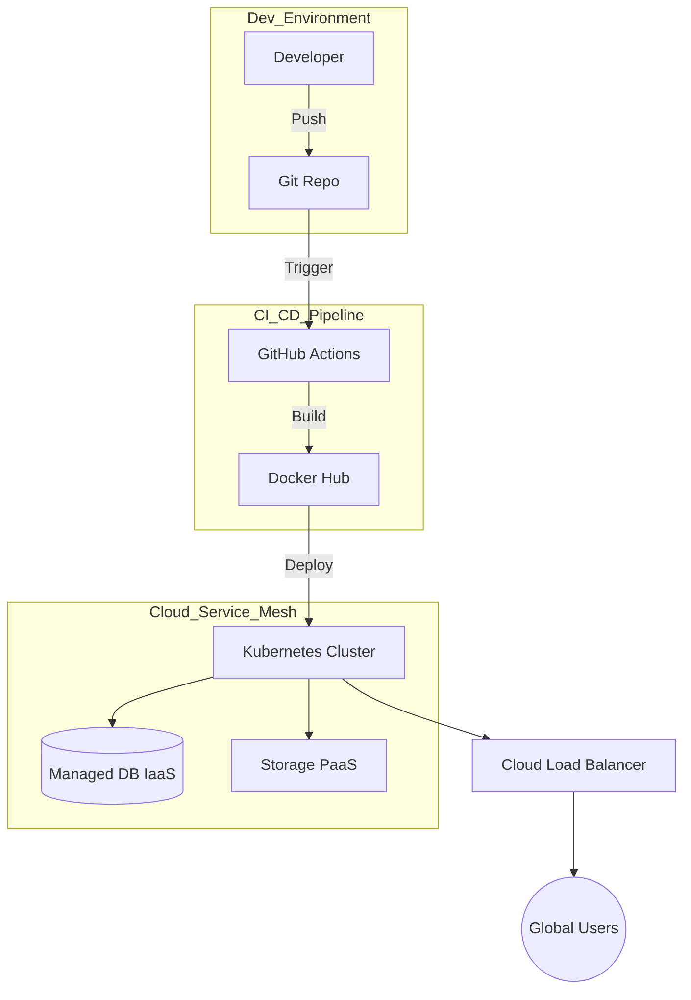

# Presentation Pitch Deck: The Legacy Dev House
## Mission: Cloud-Native Agile Powerhouse Transformation
**Lead Digital Architect: Antigravity Consulting**

---

### Slide 1: Front Office - THE TRANSFORMATION
*   **Visual Asset**: High-tech composite image of a classic architect's drawing morphing into a binary code stream.
*   **Key Bullet Points**:
    *   **Baseline Audit 2026**: Moving from analog silos to digital unity.
    *   **Strategic Vision**: Scalability, Resilience, and AI-Augmentation.
    *   **Target Horizon**: 2029 Market Leadership.
*   **Speaker Notes**: "Good morning. I am the Lead Digital Architect for this mission. Our goal is simple but profound: to take 'The Legacy Dev House' and turn it into a high-velocity, cloud-native powerhouse. We are not just upgrading servers; we are redefining how we deliver value in the AI era. Let's look at the plan." (40s)

---

### Slide 2: THE LEGACY CHALLENGE (Problem Statement)
*   **Visual Asset**: Comparison infographic showing a 'Tangled Node' (Legacy) vs. a 'Clean Mesh' (Future).
*   **Key Bullet Points**:
    *   **Technical Debt**: Zero version control (Git) leading to code collisions.
    *   **Physical Gravity**: Reliance on single-point-of-failure on-premise hardware.
    *   **Manual Friction**: 100% manual QA and ZIP-based deployments.
*   **Speaker Notes**: "Our current reality is 'Handcrafted Software'—and that's the problem. Without Git, our developers overwrite each other. On physical servers, we are one power outage away from oblivion. This lack of automation is a 'gravity' that prevents us from scaling. We're here to break that gravity today." (40s)

---

### Slide 3: STRATEGIC ROADMAP 2026-2029 (Block I)
*   **Visual Asset**: A progressive 'Level-Up' chart showing growth in CI/CD maturity and talent.
*   **Key Bullet Points**:
    *   **2026: The Foundation**: Mandatory GitOps and Infrastructure-as-Code.
    *   **2027: The Cloud Leap**: Full migration to Tier-4 High Availability Cloud.
    *   **2028: The AI Surge**: Moving to automated code synthesis and predictive QA.
*   **Speaker Notes**: "Our 3-year plan is divided into three distinct phases. Year 1 focuses on the foundation: standardizing workflows with Git. Year 2 is about the 'Cloud Leap', removing the physical burden. By year 3, we won't just be running in the cloud; we'll be optimized by AI, delivering code with near-zero defects." (40s)

---

### Slide 4: DIGITAL INVENTORY & GAP ANALYSIS (Block I)
*   **Visual Asset**: A futuristic 'Heads-Up Display' (HUD) table showing the transition metrics.
*   **Key Bullet Points**:
| Inventory Module | As-Is State | To-Be Target | Gap Closure Strategy |
| :--- | :--- | :--- | :--- |
| **Code Management** | Manual ZIP/Folders | **GitHub Enterprise** | Mandatory Branching Workshops |
| **Compute Power** | Physical On-Prem | **Azure/AWS Hybrid** | Lift-and-Shift Pilot (QA first) |
| **QA Pipeline** | Manual Testing | **Automated CI/CD** | TDD & Integration Suite |
*   **Speaker Notes**: "The gap between where we are and where we need to be is significant. We are moving from 'Folder-based development' to 'Git-based mastery'. To close this, we will implement a pilot program, moving our QA environment to the cloud first to ensure zero-downtime during the final production migration." (40s)

---

### Slide 5: SYSTEM ARCHITECTURE: CLOUD-FLOW (Block II)
*   **Visual Asset**: Deep-blue Mermaid diagram showing the end-to-end telemetry.
*   **Diagram (Mermaid - English)**:

*   **Key Bullet Points**:
    *   **Hybrid Cloud Strategy**: IaaS for legacy control; PaaS for scale.
    *   **Containerized Portability**: Docker-first microservices.
    *   **Elastic Infrastructure**: Auto-scaling based on user demand.
*   **Speaker Notes**: "Behold the new architecture. We've moved away from the single server to a distributed Service Mesh. Code is pushed to Git, built by automated pipelines, and deployed into a Kubernetes cluster. This architecture doesn't just run; it heals itself and scales automatically as our user base grows." (40s)

---

### Slide 6: DATA LIFE CYCLE & CLOUD SOVEREIGNTY (Block II)
*   **Visual Asset**: A refined circular flow diagram labeled with 'The Data Journey'.
*   **Key Bullet Points**:
    *   **Ingestion (Ingles)**: Scalable ingestion via API Gateways.
    *   **Processing (Ingles)**: Real-time ETL using Serverless Functions.
    *   **Archiving (Ingles)**: Cold storage (Glacier) for 99% cost reduction on old data.
*   **Speaker Notes**: "Our data management follows a strict 4-stage lifecycle. By using serverless processing for ingestion and cold storage for old records, we reduce our operational costs by 99% for non-active data. This is what 'Smart Cloud Sovereignty' looks like: high speed for active users, low cost for archives." (40s)

---

### Slide 7: AI IMPLEMENTATION: PREDICTIVE QA (Block III)
*   **Visual Asset**: A stylized Python code block glowing with a 'Cognitive Audit' icon.
*   **Key Bullet Points**:
    *   **Bug Prediction**: Python models (Scikit-Learn) analyzing commit risk.
    *   **Automated Review**: AI logic detecting 'Code Smells' before merging.
    *   **Efficiency Gain**: 30% reduction in production hotfixes.
*   **Speaker Notes**: "We are introducing 'Predictive QA'. Using Python-based machine learning, we analyze every commit. If the AI detects a high-risk pattern based on our historical bugs, it blocks the deployment automatically. We are moving from 'debugging' to 'predicting', significantly increasing our release confidence." (40s)

---

### Slide 8: CYBERSECURITY SHIELD: 3 CRITICAL FIXES (Block III)
*   **Visual Asset**: A 3D shield protecting a glowing database icon.
*   **Key Bullet Points**:
| Found Gaps | Technical Countermeasure | Global Standards |
| :--- | :--- | :--- |
| **Zero Authentication** | **MFA & SSO** | NIST Compliance |
| **Physical Risk** | **Cloud Isolation** | Tier-4 Data Security |
| **Plain-Text Data** | **AES-256 Encryption** | ISO/IEC 27001 |
*   **Speaker Notes**: "Security is our perimeter. We've identified three critical vulnerabilities. By moving to the cloud, we eliminate physical theft risk. We've added Multi-Factor Authentication for every developer and encrypted all data at rest with AES-256. 'The Legacy Dev House' is now a digital fortress." (40s)

---

### Slide 9: THE HUMAN FACTOR: UPSKILLING & CHANGE (Block IV)
*   **Visual Asset**: A photo of a diverse team collaborating over a modern dashboard.
*   **Key Bullet Points**:
    *   **Upskilling Path**: Transitioning senior devs into 'Cloud Architects'.
    *   **ADKAR Strategy**: Focus on *Ability* and *Reinforcement*.
    *   **Innovation Culture**: Moving from 'Fixing' to 'Creating'.
*   **Speaker Notes**: "Technology is only half the battle. Our senior developers are legends of logic; we are simply giving them new tools. Through the ADKAR model, we manage the transition: giving them the *knowledge* through workshops and the *ability* through hands-on sandboxes. Our people are the real engine of this transformation." (40s)

---

### Slide 10: ROI & FUTURE SCALABILITY (Closing)
*   **Visual Asset**: A clean 'Up and to the Right' graph showing value creation.
*   **Key Bullet Points**:
    *   **45% Faster Delivery**: Reducing deployment friction.
    *   **99.99% Reliability**: Eliminating physical server downtime.
    *   **Market Readiness**: Prepared for the next generation of AI products.
*   > "Transformation is not just a migration; it's an awakening. We are ready."
*   **Speaker Notes**: "The ROI is clear: faster delivery, higher reliability, and lower costs. But the biggest return is that we are now 'Future-Proof'. 'The Legacy Dev House' is dead; long live the 'Agile Powerhouse'. Thank you for your time, and we look forward to the first deployment of the new era." (40s)
