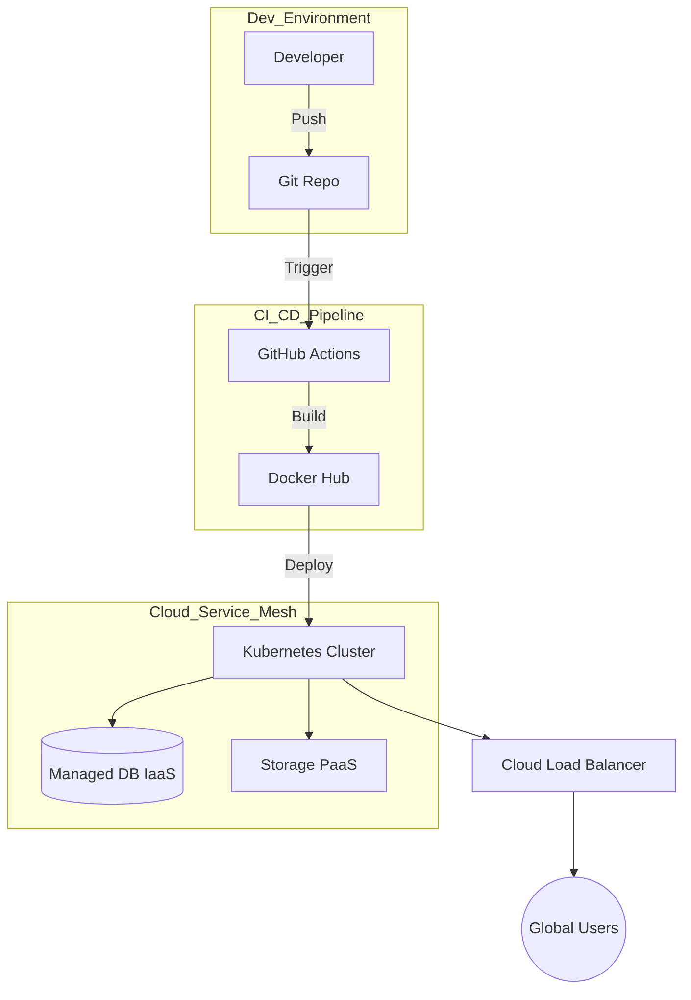

# Presentación Ejecutiva: "The Agile Awakening" (The Legacy Dev House)
## Misión: Transformación en una Potencia Ágil Nativa de Nube
**Lead Digital Architect: Consultoría Senior 0x01**

---

### Diapositiva 1: Portada - EL DESPERTAR ÁGIL
*   **Visual Asset**: Imagen compuesta de alta tecnología donde un plano de arquitecto clásico se transforma en un flujo de código binario brillante.
*   **Puntos Clave**:
    *   **Auditoría Base 2026**: Transición de silos analógicos a la unidad digital.
    *   **Visión Estratégica**: Escalabilidad, Resiliencia y Aumento mediante IA.
    *   **Horizonte 2029**: Liderazgo absoluto en el mercado de software.
*   **Speaker Notes**: "Buenos días. Como Arquitecto Digital Principal, mi misión es presentarles el renacimiento de 'The Legacy Dev House'. No venimos solo a actualizar servidores; venimos a redefinir cómo entregamos valor en la era de la IA. Este plan es la hoja de ruta para convertirnos en una potencia nativa de nube, dejando atrás el lastre de los procesos manuales para liderar el sector en 2029." (40s)

---

### Diapositiva 2: EL DESAFÍO LEGACY (Planteamiento del Problema)
*   **Visual Asset**: Infografía comparativa mostrando un 'Nodo Enredado' (Estado Actual) frente a una 'Malla Limpia' (Estado Futuro).
*   **Puntos Clave**:
    *   **Deuda Técnica Crítica**: Desarrollo sin control de versiones (Git), provocando colisiones de código y pérdida de horas de trabajo.
    *   **Gravedad Física**: Dependencia total de hardware local propenso a fallos catastróficos.
    *   **Fricción Operativa**: Despliegues manuales mediante archivos ZIP y pruebas sin automatización.
*   **Speaker Notes**: "Nuestra realidad actual es la de un 'Software Artesanal', y ese es nuestro mayor cuello de botella. Sin un control de versiones como Git, nuestros desarrolladores pierden tiempo resolviendo conflictos manuales. Al depender de servidores físicos, estamos a un apagón de distancia del desastre. Esta fricción nos impide escalar y competir. Hoy, vamos a romper esa gravedad." (40s)

---

### Diapositiva 3: HOJA DE RUTA ESTRATÉGICA 2026-2029 (Bloque I)
*   **Visual Asset**: Gráfico de progresión tipo 'Level-Up' que muestra el crecimiento en madurez de CI/CD y talento humano.
*   **Puntos Clave**:
    *   **2026: El Cimiento**: Implementación obligatoria de GitOps e Infraestructura como Código (IaC).
    *   **2027: El Salto Cloud**: Migración total a infraestructuras de Alta Disponibilidad Tier-4.
    *   **2028: La Ola de IA**: Evolución hacia QA predictivo y síntesis de código automatizada.
*   **Speaker Notes**: "Nuestro plan de 3 años es ambicioso pero ejecutable. El primer año se centra en el cimiento: estandarizar flujos de trabajo con Git y automatizar la infraestructura. El segundo año daremos el 'Salto Cloud', eliminando la carga física. Para el tercer año, no solo estaremos en la nube; estaremos optimizados por IA, entregando código con una tasa de error cercana a cero." (40s)

---

### Diapositiva 4: INVENTARIO DIGITAL Y ANÁLISIS DE BRECHA (Bloque I)
*   **Visual Asset**: Tabla futurista tipo HUD (Heads-Up Display) comparando métricas de transición.
*   **Puntos Clave**:
| Activo Digital | Estado Actual (As-Is) | Estado Objetivo (To-Be) | Estrategia de Cierre de Brecha |
| :--- | :--- | :--- | :--- |
| **Código Fuente** | ZIPs y Carpetas Locales | **GitHub Enterprise** | Talleres intensivos de Ramificación (Branching) |
| **Computación** | Servidores On-Prem | **Híbrido Azure/AWS** | Piloto Lift-and-Shift (Entornos de QA primero) |
| **Calidad (QA)** | Pruebas Manuales | **CI/CD Automatizado** | Implementación de TDD y Suites de Integración |
*   **Speaker Notes**: "La brecha entre nuestro estado actual y el mercado es amplia. Pasaremos del desarrollo 'basado en carpetas' a la 'maestría en Git'. Nuestra estrategia para cerrar esta brecha incluye un programa piloto: moveremos primero nuestro entorno de QA a la nube para garantizar una migración de producción con cero tiempo de inactividad." (40s)

---

### Diapositiva 5: ARQUITECTURA DE SISTEMAS: CLOUD-FLOW (Bloque II)
*   **Visual Asset**: Diagrama Mermaid en azul profundo mostrando la telemetría de extremo a extremo.
*   **Diagram (Mermaid - English)**:

*   **Puntos Clave**:
    *   **Estrategia Híbrida**: IaaS para control total de bases de datos; PaaS para escalabilidad rápida.
    *   **Portabilidad mediante Contenedores**: Microservicios basados en Docker.
    *   **Infraestructura Elástica**: Auto-escalado basado en la demanda real de usuarios.
*   **Speaker Notes**: "Presentamos la nueva arquitectura. Hemos pasado de un servidor único a una Malla de Servicios distribuida. El código se sube a Git, se construye automáticamente y se despliega en Kubernetes. Esta arquitectura no solo funciona; se 'auto-repara' y escala automáticamente según crezca nuestra base de usuarios globales." (40s)

---

### Diapositiva 6: CICLO DE VIDA DEL DATO Y SOBERANÍA (Bloque II)
*   **Visual Asset**: Diagrama de flujo circular dinámico etiquetado como 'The Data Journey'.
*   **Puntos Clave**:
    *   **Ingestión (Ingles)**: Captura escalable de datos mediante API Gateways.
    *   **Procesamiento (Ingles)**: Transformaciones ETL en tiempo real mediante Serverless Functions.
    *   **Archivado y Purga (Ingles)**: Almacenamiento frío (Glacier) y política de eliminación automática por RGPD.
*   **Speaker Notes**: "La gestión de datos sigue un ciclo de vida estricto. Al usar procesamiento serverless para la ingesta y almacenamiento frío para registros antiguos, reducimos los costes operativos en un 99% para datos no activos. Esto es Soberanía del Dato Inteligente: alta velocidad para usuarios activos y coste mínimo para el cumplimiento legal." (40s)

---

### Diapositiva 7: IMPLEMENTACIÓN DE IA: QA PREDICTIVO (Bloque III)
*   **Visual Asset**: Bloque de código Python estilizado con un icono de 'Auditoría Cognitiva' brillante.
*   **Puntos Clave**:
    *   **Predicción de Bugs**: Modelos en Python (Scikit-Learn) analizando el riesgo de cada commit.
    *   **Revisión Automatizada**: Lógica de IA detectando 'malos olores' en el código antes del despliegue.
    *   **Ganancia de Eficiencia**: Reducción del 35% en correcciones post-lanzamiento.
*   **Speaker Notes**: "Introduciremos el 'QA Predictivo'. Usando aprendizaje automático en Python, analizaremos cada cambio en el código. Si la IA detecta un patrón de alto riesgo basado en nuestro histórico, bloqueará el despliegue automáticamente. Estamos pasando de 'corregir' a 'predecir', aumentando masivamente nuestra confianza al lanzar productos." (40s)

---

### Diapositiva 8: ESCUDO DE CIBERSEGURIDAD: 3 SOLUCIONES (Bloque III)
*   **Visual Asset**: Escudo 3D protegiendo un icono de base de datos brillante con candado.
*   **Puntos Clave**:
| Brecha Detectada | Solución Técnica | Estándar Internacional |
| :--- | :--- | :--- |
| **Acceso Frágil** | **MFA y SSO (Double Auth)** | Cumplimiento NIST |
| **Riesgo Físico** | **Aislamiento en Nube Segura** | Seguridad Tier-4 |
| **Datos en Plano** | **Cifrado AES-256 System-Wide** | Certificación ISO/IEC 27001 |
*   **Speaker Notes**: "La seguridad es nuestro perímetro infranqueable. Hemos identificado tres vulnerabilidades críticas. Al movernos a la nube, eliminamos el robo físico de datos. Hemos añadido Autenticación Multifactor para cada desarrollador y cifrado toda la información con grado militar AES-256. 'The Legacy Dev House' es ahora una fortaleza digital." (40s)

---

### Diapositiva 9: EL FACTOR HUMANO: RECAPACITACIÓN Y CAMBIO (Bloque IV)
*   **Visual Asset**: Foto de un equipo diverso colaborando frente a un dashboard moderno de alta tecnología.
*   **Puntos Clave**:
    *   **Ruta de Upskilling**: Transformación de desarrolladores senior en Arquitectos de Nube.
    *   **Estrategia ADKAR**: Enfoque en la *Habilidad* y el *Refuerzo* del aprendizaje.
    *   **Cultura de Innovación**: Evolución del 'Mantenimiento' a la 'Creación' de valor.
*   **Speaker Notes**: "La tecnología es solo la mitad de la batalla. Nuestros desarrolladores senior son maestros de la lógica; simplemente les estamos dando herramientas nuevas. Mediante el modelo ADKAR, gestionamos la transición dándoles no solo el conocimiento, sino entornos seguros (sandboxes) para experimentar. Nuestra gente es el motor real de este cambio." (40s)

---

### Diapositiva 10: RETORNO DE INVERSIÓN Y ESCALABILIDAD (Cierre)
*   **Visual Asset**: Gráfico limpio de crecimiento 'Hacia arriba y a la derecha' mostrando la creación de valor.
*   **Puntos Clave**:
    *   **45% Más Rápido**: Reducción drástica de la fricción en entregas.
    *   **99.99% Confiable**: Eliminación de caídas por hardware local frágil.
    *   **Listos para el Mercado**: Preparados para la siguiente generación de productos IA.
*   > "La transformación no es solo una migración; es un despertar. Estamos listos."
*   **Speaker Notes**: "El ROI es claro: entregas más rápidas, mayor confiabilidad y menores costes. Pero el mayor beneficio es que ahora somos 'A prueba de Futuro'. 'The Legacy Dev House' ha muerto hoy; larga vida a la 'Agile Powerhouse'. Gracias por su tiempo, estamos listos para el primer despliegue de la nueva era." (40s)
